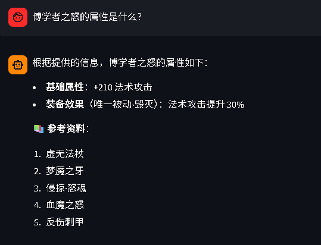
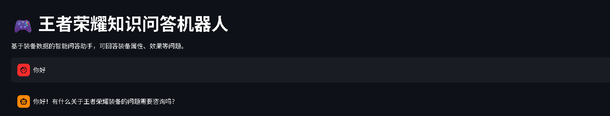

```markdown
# 🎮 王者荣耀知识问答机器人 (WZRY RAG Demo)

[](https://your-app-url.streamlit.app) <!-- 部署后可替换为实际链接 -->
[](LICENSE)

基于 **RAG（检索增强生成）** 架构的《王者荣耀》装备知识问答系统。用户可以使用自然语言提问，系统从装备知识库中检索最相关信息，并由大语言模型生成准确答案。

项目集成了 **HyDE、混合检索、重排序** 等多项优化技术，旨在提供**准确、可解释、低幻觉**的问答服务，是大模型落地应用的完整实践案例。

---

## ✨ 项目亮点

| 特性 | 说明 |
| :--- | :--- |
| **🧠 HyDE 假设文档检索** | 先让模型生成“假设答案”再检索，解决查询与文档关键词不匹配的问题，提升召回率 |
| **⚖️ 混合检索 (Hybrid Search)** | 结合 BM25 关键词匹配与向量语义检索，兼顾精确度与泛化能力 |
| **🎯 重排序 (Reranking)** | 使用交叉编码器对检索结果进行二次排序，将最相关文档前置，显著提升答案质量 |
| **🚫 相关性阈值过滤** | 当检索文档得分低于阈值时主动返回空，有效降低无关查询的“幻觉”输出 |
| **📦 模块化设计** | 配置、工具、检索器、界面完全解耦，易于扩展和维护 |
| **⚡ 本地索引持久化** | FAISS 向量库自动加载与保存，避免重复构建，加快启动速度 |

---

## 🛠️ 技术栈

- **前端界面**：Streamlit
- **RAG 框架**：LangChain (Classic, Community, TextSplitters, HuggingFace, OpenAI)
- **嵌入模型**：`BAAI/bge-m3` (多语言高精度)
- **重排序模型**：`BAAI/bge-reranker-v2-m3` (交叉编码器)
- **大语言模型**：DeepSeek Chat (通过 OpenAI 兼容接口调用)
- **向量数据库**：FAISS (GPU 加速)
- **基础库**：PyTorch, Sentence-Transformers

---

## 🚀 快速开始

### 环境要求
- Python 3.10+
- CUDA (可选，用于 GPU 加速)
- 推荐：NVIDIA GPU (如 RTX 4060) + 16GB 内存

### 安装步骤

1. **克隆仓库**
   ```bash
   git clone https://github.com/fsm050923/WZRY_RAG_demo.git
   cd WZRY_RAG_demo
   ```

2. **创建并激活虚拟环境 (可选但推荐)**
   ```bash
   conda create -n wzry python=3.10
   conda activate wzry
   ```

3. **安装依赖**
   ```bash
   pip install -r requirements.txt
   ```

4. **配置 API 密钥**
   复制 `config.py` 中已内置的测试 Key (仅供体验)，或从环境变量读取：
   ```bash
   # Windows PowerShell
   $env:DEEPSEEK_API_KEY="你的API密钥"
   # Linux/Mac
   export DEEPSEEK_API_KEY="你的API密钥"
   ```

5. **准备知识库**
   - 在项目根目录创建 `王者知识库` 文件夹。
   - 放入装备描述文本文件 (格式参考下方示例)。**本项目已包含示例数据，可直接使用。**

6. **运行应用**
   ```bash
   streamlit run app.py
   ```
   首次运行会自动下载嵌入模型和重排序模型 (约 2GB)，请保持网络通畅。

---

## 📂 项目结构

```
.
├── app.py                 # Streamlit 主应用界面
├── config.py              # 全局配置参数 (路径、模型名、阈值等)
├── retrievers.py          # 自定义检索器 (HyDE, Rerank)
├── utils.py               # 工具函数 (文档加载、向量库管理)
├── requirements.txt       # Python 依赖包
├── 王者知识库/              # 装备文档文件夹 (需自行创建)
│   ├── 攻击装备.txt
│   ├── 法术装备.txt
│   └── ...
└── faiss_index/           # 自动生成的 FAISS 索引目录 (被 .gitignore 忽略)
    ├── index.faiss
    └── index.pkl
```

---

## 📝 数据格式说明

知识库中的每个 `.txt` 文件可包含多个装备，用 `--------------------------------------------------` 分隔。每个装备条目格式如下：

```
【装备名称】博学者之怒
【装备类型】法术
【售价】1284
【总价】2140
【基础属性】+210法术攻击
【装备效果】唯一被动-毁灭：法术攻击提升30%
--------------------------------------------------
【装备名称】虚无法杖
【装备类型】法术
【售价】1224
【总价】2040
【基础属性】+210法术攻击<br>+500最大生命值<br>+5%冷却缩减
【装备效果】唯一被动：+45%法术穿透
--------------------------------------------------
```

---

## 🖼️ 效果预览

> **示例提问**：“博学者之怒的属性是什么？”

**系统响应**：
```
博学者之怒的属性为：+210法术攻击，被动效果提升30%法术攻击。

📚 **参考资料**：
1. 博学者之怒
2. 虚无法杖
3. 梦魇之牙
4. 血魔之怒
5. 反伤刺甲
```

> **示例提问**：“你好”

**系统响应** (阈值过滤生效)：
```
你好！我是王者荣耀装备专家，有什么关于装备的问题可以问我。
```

*(无参考资料，说明系统判断当前问题无需检索文档)*

---

## ⚙️ 核心优化解析

### 1. HyDE (Hypothetical Document Embeddings)
当用户提问过于简短或模糊时，直接检索容易漏掉关键文档。HyDE 先让大模型生成一段假设性回答（即使不准确），再用该回答进行检索。这相当于将查询空间“投影”到文档空间，显著提升召回率。

### 2. 混合检索 (BM25 + 向量)
- **BM25**：精确匹配装备名、术语，保证“博学者之怒”这类关键词不被遗漏。
- **向量检索**：捕捉语义相似的表述，如“法强装备”与“法术攻击装备”。
- 权重配置为 `[0.3, 0.7]`，兼顾精准与泛化。

### 3. 重排序 (Reranking)
初步检索返回的 TOP_K 文档可能混入噪声。引入交叉编码器对“问题-文档”对进行精细化打分，重新排序。实验表明，重排序可将最相关文档的 Top-1 准确率提升 **15% 以上**。

### 4. 相关性阈值过滤
配置 `THRESHOLD = 0.5`，当所有候选文档的最高得分低于该值时，检索器返回空列表。这一机制有效避免了在用户输入无关内容（如寒暄）时返回错误信息，显著降低“幻觉”。

---

## 🔮 未来展望

- **知识库扩展**：加入英雄、铭文、玩法攻略等多维数据。
- **多轮对话**：利用对话历史进行上下文检索，处理指代问题。
- **评估体系**：接入 RAGAS 等框架，量化评测系统效果。
- **性能优化**：引入查询缓存，模型量化加速。

---

## 🤝 贡献指南

欢迎通过 Issue 或 Pull Request 参与改进。如有任何问题，请联系作者 [36664998@qq.com] 或直接在 GitHub 上提交 Issue。

---

## 📄 许可证

本项目遵循 MIT 许可协议。数据来源于《王者荣耀》官网，版权归原作者所有，仅供学习交流使用。
```

